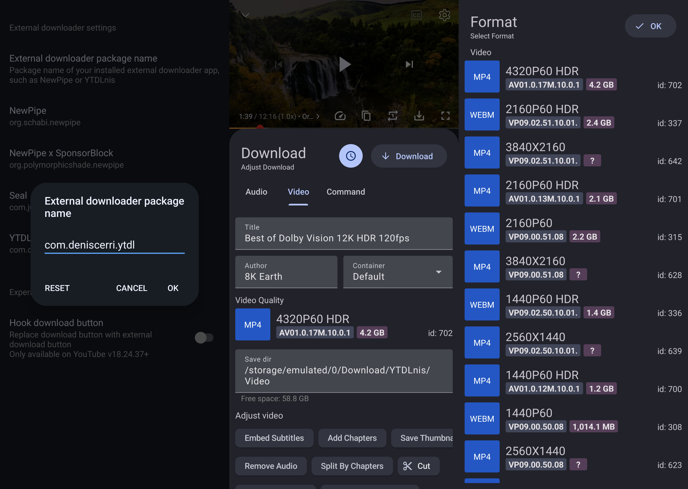
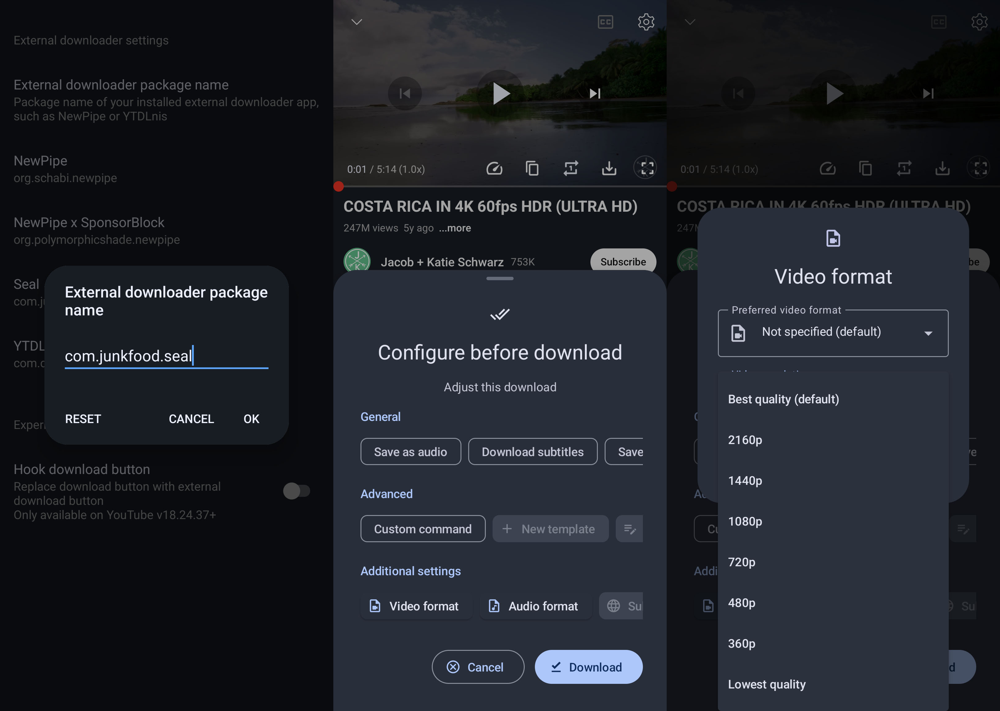
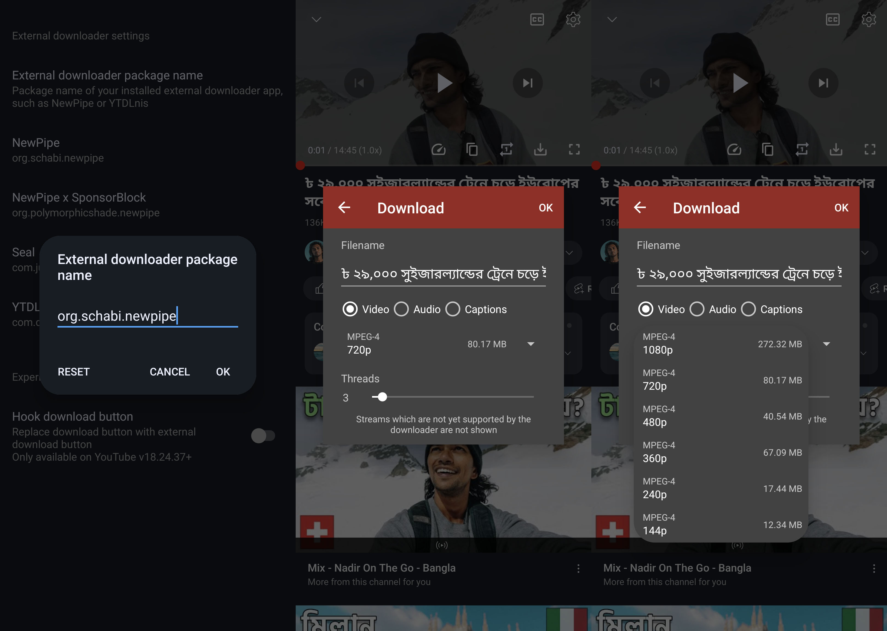
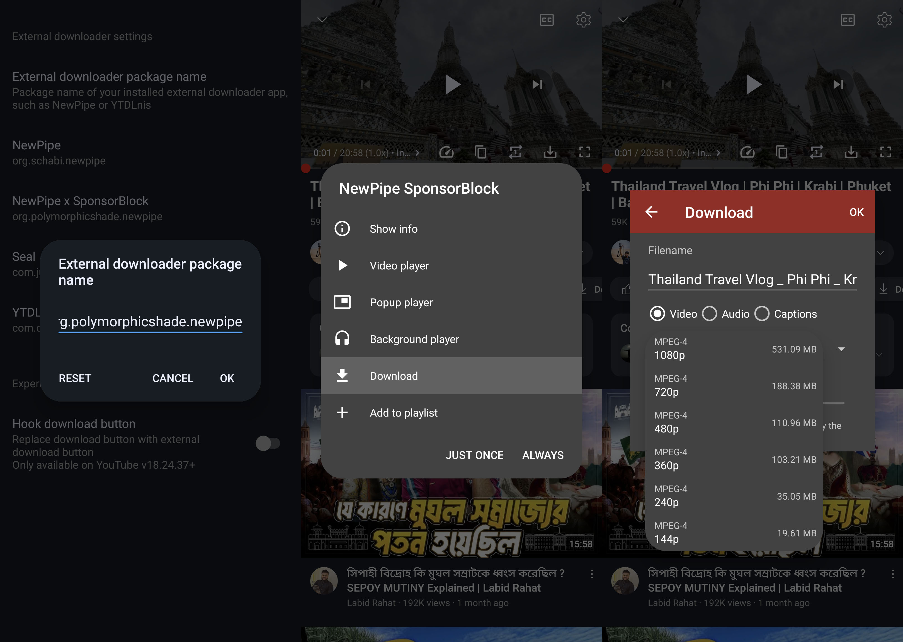
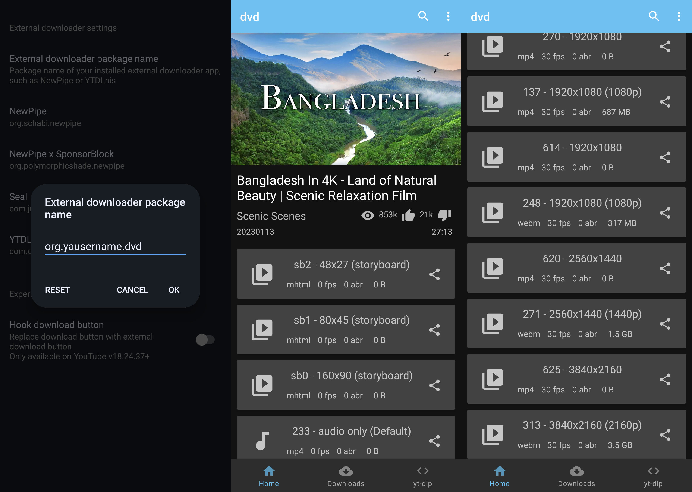
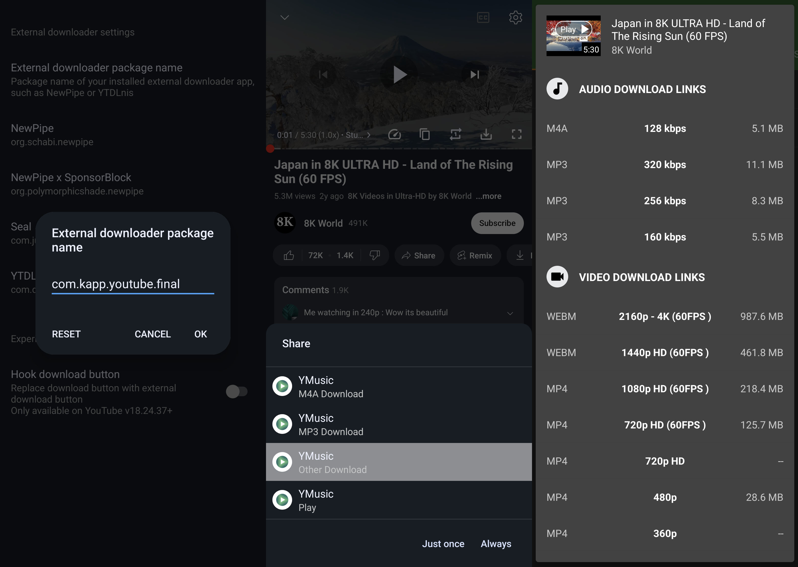
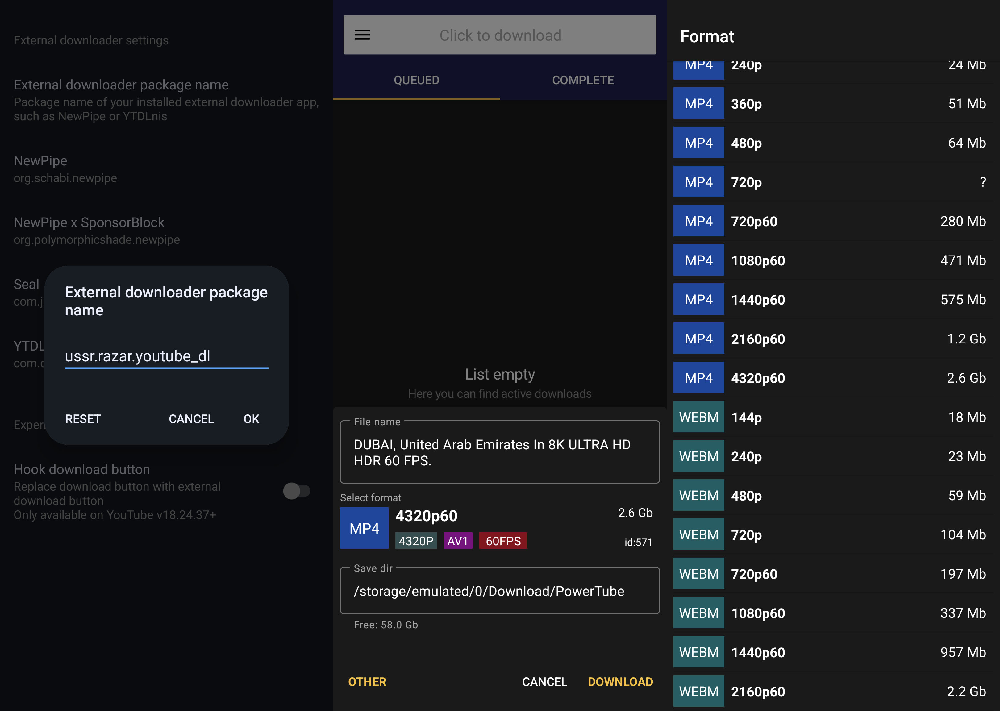
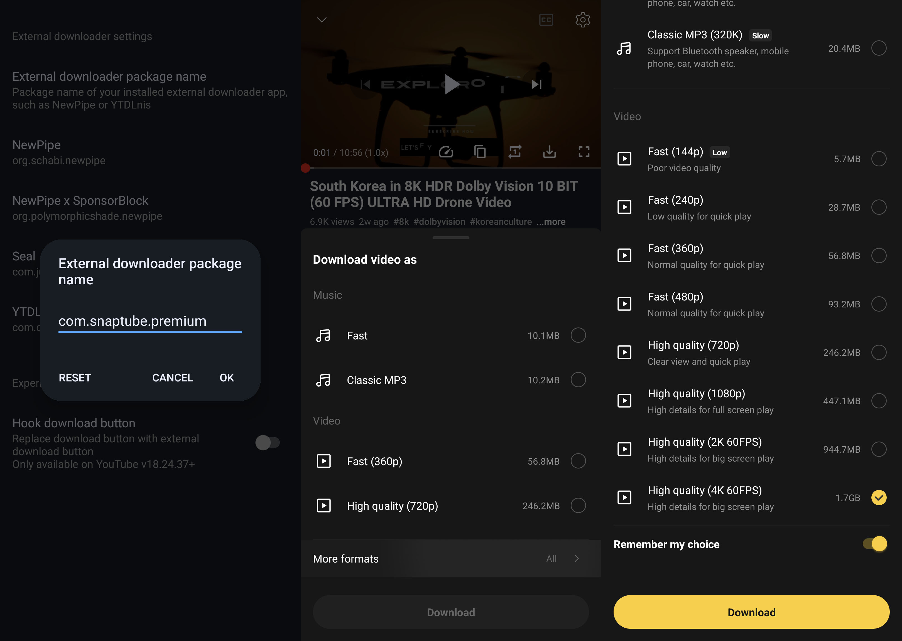

# External Downloader App for YouTube/Music
With the help of these applications, you can effortlessly download any YouTube video or song.

### Open Source Downloader App

+++ YTDLnis
#### Package name
```
com.deniscerri.ytdl
```

[!button variant="secondary" text="📥 GitHub"](https://github.com/deniscerri/ytdlnis/releases/latest) [!button variant="warning" text="📥 F-Droid"](https://apt.izzysoft.de/fdroid/index/apk/com.deniscerri.ytdl)

==- Example Image

===

#### Features
- Video downloads up to 4k in WebM, MP4 and MKV & 8K MP4 also supports HDR Download
- Audio downloads in multiple formats - MP3, M4A, AAC, ALAC, FLAC, OPUS, WAV (but most commonly in the first 2)
- Ability to download without SponsorBlock segments
- Ability to edit the video before downloading
- Needs external player
- Ability to download playlists
- Embed subtitles
- You can use it as a search engine to search for youtube videos you want to download(you CAN'T play them in the app itself)
- Ability to backup and restore everything - from settings to search history(as a json file)

+++ Seal
#### Package name
```
com.junkfood.seal
```
[!button variant="secondary" text="📥 GitHub"](https://github.com/JunkFood02/Seal/releases/latest) [!button variant="warning" text="📥 F-Droid"](https://www.f-droid.org/packages/com.junkfood.seal/)

==- Example image

===

#### Features
- Video downloads up to 4k in 3 formats - MP4, WebM and MKV
- Audio downloads in 2 formats - MP3 and M4A
- Ability to download without SponsorBlock segments
- Needs external player
- Ability to download playlists
- Embed subtitles

+++ NewPipe
#### Package name
```
org.schabi.newpipe
```
[!button variant="secondary" text="📥 GitHub"](https://github.com/TeamNewPipe/NewPipe/releases/latest) [!button variant="warning" text="📥 F-Droid"](https://f-droid.org/packages/org.schabi.newpipe/#latest)

==- Example image

===

#### Features
- Video downloads up to 4k60fps(haven't tested 8k) in 3 different formats - MPEG-4, WebM and 3GP(formats change depending on the quality)
- Audio downloads up to 128kbps in M4A and up to 160kbps in WebM
- Background playback and PIP
- Swipe controls for volume and brightness

+++ Tubular

#### Package name
```
org.polymorphicshade.tubular
```
[!button variant="secondary" text="📥 GitHub"](https://github.com/polymorphicshade/Tubular/releases/latest) [!button variant="warning" text="📥 F-Droid"](https://apt.izzysoft.de/fdroid/index/apk/org.polymorphicshade.tubular)

==- Example image

===

#### Features
- Video downloads up to 4k60fps(haven't tested 8k) in 3 different formats - MPEG-4, WebM and 3GP(formats change depending on the quality)
- Audio downloads up to 128kbps in M4A and up to 160kbps in WebM
- Background playback and PIP
- Swipe controls for volume and brightness
- SponsorBlock and Return Youtube Dislikes
+++ DVD
#### Package name
```
org.yausername.dvd
```
[!button variant="secondary" text="📥 GitHub"](https://github.com/yausername/dvd/releases/latest) [!button variant="warning" text="📥 F-Droid"](https://f-droid.org/packages/org.yausername.dvd/)

==- Example image

===

#### Features
- Video downloads up to 8k 60fps in 3 different formats - MPEG-4, WebM and 3GP (formats change depending on the quality)
- Audio downloads up to 250 kbps in both M4A and WebM
- Needs external player
+++

### Close Source Downloader App

+++ YMusic
#### Package name
```
com.kapp.youtube.final
```
[!button variant="secondary" text="📥 Download"](https://ymusic.io/#btnDownload)

==- Example image

===

#### Features
- Video downloads up to 4k60fps in WebM and MP4
- Audio downloads up to 320 kbps in MP3 and M4A
- SponsorBlock
- Background playback
- It can be used as a youtube alternative. You can login with your google account and try it out.
- Doesn't require an external player

+++ PowerTube
#### Package name
```
ussr.razar.youtube_dl
```
[!button variant="secondary" text="📥 GitHub"](https://github.com/razar-dev/PowerTube/releases/latest)

==- Example image

===

!!!
This app hasn't been updated since January 2022 and as such it may not work properly all the time, due to recent changes in YouTube's API
!!!

### Features
- Video downloads up to 8k60fps in 2 formats - WebM and MP4
- Audio downloads up to 128kbps in M4A and up to 160kbps in WebM
- Swipe controls for volume and brightness
- Ability to download playlists

+++ Snaptube
#### Package name
```
com.snaptube.premium
```
[!button variant="secondary" text="📥 Download"](https://www.snaptube.com/#dl-main)

!!!
This app may shows ads.
!!!

==- Example image

===

#### Features
- Video Downloading Accessible From Multiple Sites
- Multiple Resolutions from 240p to 4K HD to Stream and Download Videos
- Free Download Access to Every Video Link
- Download and Watch Offline Videos Seamlessly
+++

### Configure Downloader App

+++ Configure downloader for YT
#### Set Downloader Package name
- Navigate to the YouTube settings -> **ReVanced**
- Tap: **Player**
- Tap: **External downloads**
- Tap: **Downloader package name**
- Please input the _package name_ for the app you wish to configure and then click the **OK** button.


==- How does the Downloader Works?
Downloaders allow you to download any video from YouTube directly. Simply set up a downloader and then click on the download icon on the video player to start downloading any videos.

===

+++ Configure downloader for YT Music

#### Set Downloader Package name
- Navigate to the YouTube Music Setting -> **ReVanced Extended**

- Scroll down and turn on the **Hook share** button.

- Select **Package name of the downloader** to configure the package name of your preferred downloader.

- Please input the _package name_ for the app you wish to configure and then click the **OK** button.


==- How does the downloader work?
- Listen to any music on YT Music ReVanced Extended.
- Tap on the **share button** located on the player.

- Save it in the audio/mp3 format.

===

+++
